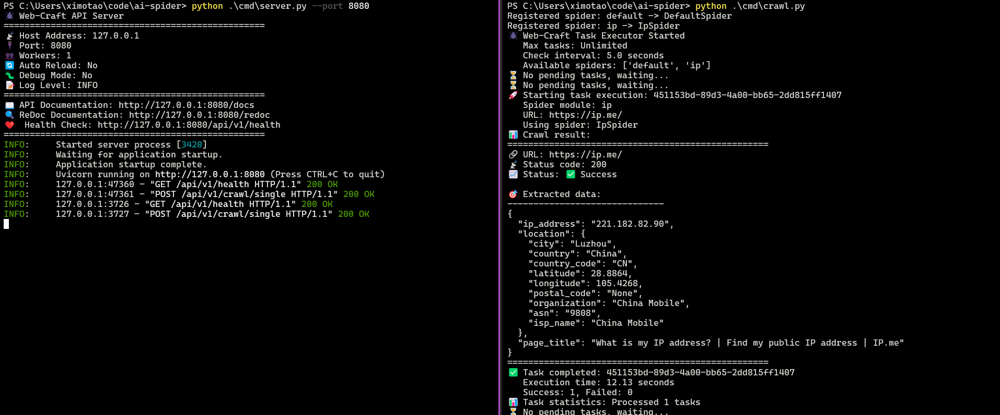

# Web-Craft - Intelligent Web Scraping System

A Python-based modular web scraping framework focused on efficient single URL crawling, supporting asynchronous processing, API services, and highly customizable spider modules.

## 📸 Screenshot


This backend pairs with the **Web-Craft-UI** for real-time spider management and health monitoring. Clone the UI repo here: [https://github.com/happytaoer/web-craft-ui](https://github.com/happytaoer/web-craft-ui)


## 📦 Quick Installation

### Requirements
- Python 3.11+
- Redis Server 5.0+
- pip package manager

### Installation Steps
```bash
# 1. Clone the project
git clone https://github.com/happytaoer/web-craft.git
cd web-craft

# 2. Install dependencies
pip install -r requirements.txt

# 3. Install and start Redis
redis-server

# 4. Setup configuration
cp config.example.toml config.toml
# Edit config.toml to customize Redis and other settings

# 5. Verify installation
python -m tests.test_ip_crawl
```

## 🏗️ Project Architecture

```
web-craft/
├── worker/                 # Worker Layer - Spider Engine  
├── output/                 # Output Layer - Data Export
├── api/                    # API Layer - Web Interface
│   ├── spider_service.py  # Spider Service (RQ Integration)
│   ├── routes.py          # API Routes
│   └── models.py          # API Data Models
├── cmd/                    # Command Line Tools
│   ├── server.py          # API Server
│   └── crawl.py           # RQ Worker
├── tasks/                  # Task Management System (RQ-based)
│   ├── queue.py           # RQ Task Queue Manager
│   └── worker_tasks.py    # Worker Task Functions
├── spiders/                # Spider Module System
│   ├── core/              # Framework Core Components
│   │   ├── base_spider.py # Base Spider Abstract Class
│   │   └── spider_loader.py # Spider Loader
│   └── spiders/           # User Custom Spiders
│       ├── ip.py          # IP Address Spider
│       └── hackernews.py  # Hacker News Spider
├── tests/                  # Test Suite
├── config.py               # Configuration Module
├── config.toml             # Configuration File (user-specific, not in git)
├── config.example.toml     # Configuration Example Template
├── requirements.txt        # Dependencies
└── README.md              # Project Documentation
```

## ✨ Core Features

- 🌐 **RESTful API** - Complete Web API interface
- 🎯 **Single URL Focus** - Efficient single webpage crawling
- ⚡ **RQ Task Queue** - Redis-based distributed task queue with RQ
- 🔧 **Modular Design** - Extensible spider module system
- 🔄 **Auto Retry** - Intelligent retry mechanism
- 📊 **Job Tracking** - Real-time job status and result tracking
- 🧪 **Custom Parsing** - Users have full control over data extraction logic in parse methods
- 🤖 **AI-Friendly** - Simple interface design makes it perfect for AI-assisted spider development
- 🚀 **Scalable** - Multiple workers can process tasks concurrently

## 🚀 Quick Start

### 1. Start the System

```bash
# Terminal 1: Start Redis server (if not already running)
redis-server

# Terminal 2: Start API server
python cmd/server.py --port 8080

# Terminal 3: Start RQ worker
python cmd/crawl.py

# Optional: Start multiple workers for parallel processing
python cmd/crawl.py  # Worker 2
python cmd/crawl.py  # Worker 3
```

### 2. Use API for Crawling

```bash
# Single URL crawling
curl -X POST "http://127.0.0.1:8080/api/v1/crawl/single" \
  -H "Content-Type: application/json" \
  -d '{"spider_name": "ipspider", "timeout": 15}'

# Or use Hacker News spider
curl -X POST "http://127.0.0.1:8080/api/v1/crawl/single" \
  -H "Content-Type: application/json" \
  -d '{"spider_name": "hackernewsspider", "timeout": 20}'
```

### 3. Run Tests

```bash
# Test IP spider
python -m tests.test_ip_crawl

# Test Hacker News spider
python -m tests.test_hackernews
```

## 🔧 Configuration Options

### Configuration File (config.toml)

Web-Craft uses TOML format for configuration management, following Python best practices.

**Setup**: Copy `config.example.toml` to `config.toml` and customize as needed:
```bash
cp config.example.toml config.toml
```

**Note**: `config.toml` is user-specific and should not be committed to version control (add to `.gitignore`).

```toml
[spider]
# Spider configuration
timeout = 30        # Request timeout (seconds)
max_retries = 3     # Maximum retry count for task queue

[redis]
# Redis configuration for RQ task queue
host = "localhost"  # Redis server host
port = 6379         # Redis server port
db = 0              # Redis database number
password = ""       # Redis password (leave empty if no password)
queue_name = "web_craft_tasks"  # RQ queue name

[server]
# API server configuration
host = "127.0.0.1"
port = 8000
workers = 1

[logging]
# Logging configuration
level = "INFO"
format = "%(asctime)s - %(name)s - %(levelname)s - %(message)s"
```

### Using Configuration in Code

```python
from config import config

# Access configuration
timeout = config.spider.timeout
max_retries = config.spider.max_retries
redis_host = config.redis.host
redis_port = config.redis.port
queue_name = config.redis.queue_name

# Modify configuration at runtime
config.spider.timeout = 60
```

### Command Line Arguments

```bash
# API server arguments
python cmd/server.py --port 8080 --host 0.0.0.0
python cmd/server.py --reload --log-level DEBUG
python cmd/server.py --workers 4  # Production mode with 4 workers

# RQ worker arguments
python cmd/crawl.py
python cmd/crawl.py --burst  # Run in burst mode (quit after all jobs processed)
python cmd/crawl.py --queues web_craft_tasks high_priority  # Listen to multiple queues
```
## 📖 API Documentation

After starting the API service, visit the following URLs to view documentation:
- **Swagger UI**: http://127.0.0.1:8080/docs
- **ReDoc**: http://127.0.0.1:8080/redoc

## 🔧 FAQ

### Q: How to create custom spiders?
A: Inherit from BaseSpider class, configure the target URL, and implement the parse method:
```python
from spiders.core.base_spider import BaseSpider
from lxml import html

class MySpider(BaseSpider):
    # Configure the target URL and HTTP method in spider class
    start_url = "https://example.com"
    method = "GET"  # Optional, defaults to GET
    
    def parse(self, raw_content: str, url: str, headers: dict) -> dict:
        # Use lxml, BeautifulSoup or other tools for parsing
        tree = html.fromstring(raw_content)
        
        # Completely custom data extraction logic using XPath
        return {
            "title": tree.xpath('//title/text()')[0] if tree.xpath('//title/text()') else '',
            "headings": tree.xpath('//h1/text() | //h2/text()'),
            "links": tree.xpath('//a/@href'),
            "custom_field": "your custom extraction logic here"
        }
```

**Key Points:**
- Set `start_url` as a class attribute to define the target URL
- Set `method` to specify HTTP method (defaults to "GET")
- No need to pass URL or method in API requests - they're configured in the spider
- Focus on implementing the `parse()` method for data extraction

**Real-world Examples:**

See `spiders/spiders/ip.py` for IP address extraction:
```python
class IpSpider(BaseSpider):
    start_url = "https://ip.me"
    
    def parse(self, raw_content: str, url: str, headers: dict) -> dict:
        tree = html.fromstring(raw_content)
        return {
            'ip_address': tree.xpath('//input[@name="ip"]/@value')[0],
            'location': {
                'city': tree.xpath('//th[text()="City:"]/following-sibling::td/code/text()')[0],
                'country': tree.xpath('//th[text()="Country:"]/following-sibling::td/code/text()')[0]
            }
        }
```

See `spiders/spiders/hackernews.py` for Hacker News scraping:
```python
class HackerNewsSpider(BaseSpider):
    start_url = "https://news.ycombinator.com"
    
    def parse(self, raw_content: str, url: str, headers: dict) -> dict:
        tree = html.fromstring(raw_content)
        news_items = []
        
        for story in tree.xpath('//tr[@class="athing submission"]'):
            item = {
                'rank': int(story.xpath('.//span[@class="rank"]/text()')[0].rstrip('.')),
                'title': story.xpath('.//span[@class="titleline"]/a[1]/text()')[0],
                'url': story.xpath('.//span[@class="titleline"]/a[1]/@href')[0]
            }
            news_items.append(item)
        
        return {'news_items': news_items, 'total_items': len(news_items)}
```

### Q: Why is Web-Craft perfect for AI-assisted development?
A: **Web-Craft's simple and clean interface design makes it ideal for AI code generation:**

🤖 **Minimal Interface Requirements**:
- Only need to set `start_url` (and optionally `method`) and implement the `parse()` method
- Simple method signature: `parse(raw_content: str, url: str, headers: dict) -> dict`
- No complex inheritance chains or framework-specific patterns
- All configuration is declarative and clear - no runtime parameters needed

🎯 **AI-Friendly Design**:
```python
# AI can easily generate spiders like this:
class AIGeneratedSpider(BaseSpider):
    # Clear URL configuration
    start_url = "https://target-site.com"
    
    def parse(self, raw_content: str, url: str, headers: dict) -> dict:
        # AI can focus purely on data extraction logic
        # No need to understand complex framework internals
        tree = html.fromstring(raw_content)
        return {"data": tree.xpath('//div[@class="content"]/text()')}
```

🚀 **Perfect for AI Prompts**:
- "Create a spider that extracts product information from e-commerce pages"
- "Generate a news article spider that gets title, content, and publish date"
- "Build a spider for social media posts with likes, comments, and shares"

The framework handles all the complexity (HTTP requests, retries, async processing, task management) while AI focuses on the core parsing logic!

## 📄 License

MIT License - See [LICENSE](LICENSE) file for details

## 🤝 Contributing

Issues and Pull Requests are welcome!

## 📞 Support

If you encounter problems, please:
1. Check the [FAQ](#-faq) section
2. View [API Documentation](#-api-documentation)
3. Run tests to verify system status
4. Submit an Issue describing the problem

